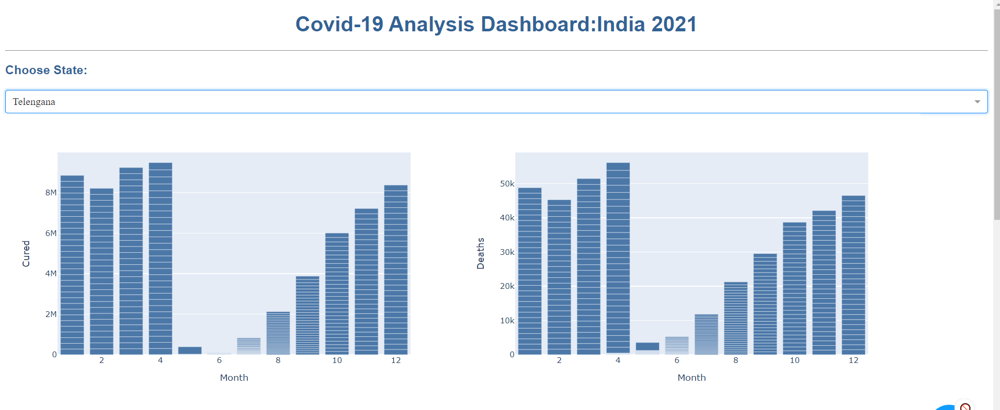
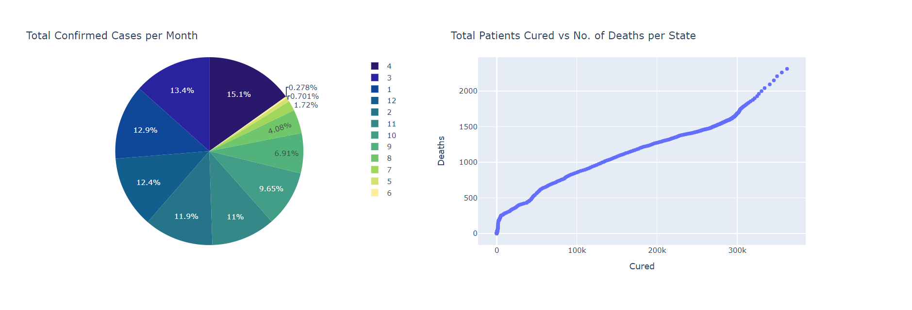

## COVID-19 INTERACTIVE DASHBOARD USING DASH

Below Web-App illustrates the charts and analyzes the State-wise COVID-19 cases in India.It touches on points like total cases,total cured cases as well as total deaths in a particular state.

Dash apps give a point-&-click interface to models written in Python, R, and Julia - vastly expanding the notion of what's possible in a traditional "dashboard.
With Dash apps, data scientists and engineers put complex Python analytics in the hands of business decision makers and operators.

Below are the Visualizations of the Web-App.

 

